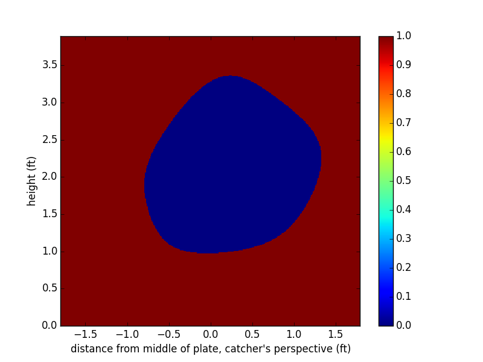

# mlb-call-classifier
Umpire's aren't perfect. It's impossible to call pitches correctly
100 percent of the time. A lot of pitches end up on the corners and edges
of the strike zone. But can we find patterns in umpires' calls?
Do some umpires tend to call low pitches strikes and high pitches balls?
This classifier uses a supervised machine learning algorithm with `neuralpy` and MLB GameDay Data to develop a graphical representation of how an umpire sees his or her *unique strikezone.*

Here are some examples. where the blue, `0`, represents the strikezone and red, `1`, represents the area
outside the strikezone.

Average heights of bottom and tops of strike zone: http://www.baseballprospectus.com/article.php?articleid=14098

#### CB Bucknor
###### Right-handed Batter
Training set: 920 examples: 68% used for training, 32% for test validation.  
Hyperparameters: 2-7-1 network with 200 epochs, 0.05 learning rate, 60% mini-batch size.  
Accuracy: 93% on test examples. Best of ten.

###### Left-handed Batter
Training set: 759 examples: 68% used for training, 32% for test validation.  
Hyperparameters: 2-7-1 network with 200 epochs, 0.05 learning rate, 60% mini-batch size.  
Accuracy: 95% on test examples. Best of ten.

